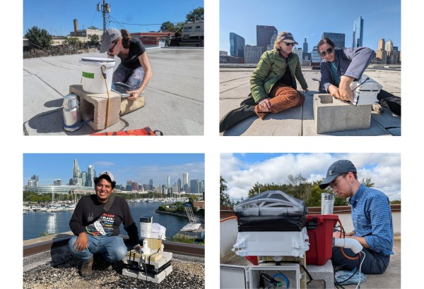
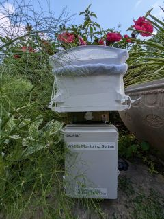

The **Chicago Bird Migration Monitoring Network** is a collaborative effort to track the movements of migratory birds through Chicagoland.  
We use **acoustics, thermal imagery, radar,** and other technologies to advance scientific understanding while bringing knowledge and awareness of migratory birds to new audiences.  
This site showcases the latest bird migration data from our live network of acoustic monitoring devices across Chicagoland.

## Powered By Nighthawk AI

Data is automatically processed with [Nighthawk AI](https://www.migrationbiology.org/software),  
a machine learning model for acoustic monitoring of nocturnal bird migration.  
It may not yet have been verified by an expert.

## Wildlife Monitoring Station

## Organizing Labs

- [Windy City Bird Lab NFP](http://windycitybirdlab.org)
- [Van Doren Lab of Migration Biology](https://migrationbiology.org/)
- [Lipshutz Lab at Duke University](https://saralipshutz.wordpress.com/)

## People

- **J'orge Garcia** - Windy City Bird Lab
- **Dr. Benjamin M. Van Doren** - University of Illinois Urbana-Champaign
- **廖書躍 (Winnie Liao)** - University of Illinois Urbana-Champaign
- **Madison Chudzik** - Duke University
- **Sara Lipshutz** - Duke University
- **Alice Hargrave** - Artist

## Collaborators

![Collaborators(img/collabs.jpg)

## Contact

info@chicagobirdmigration.net
